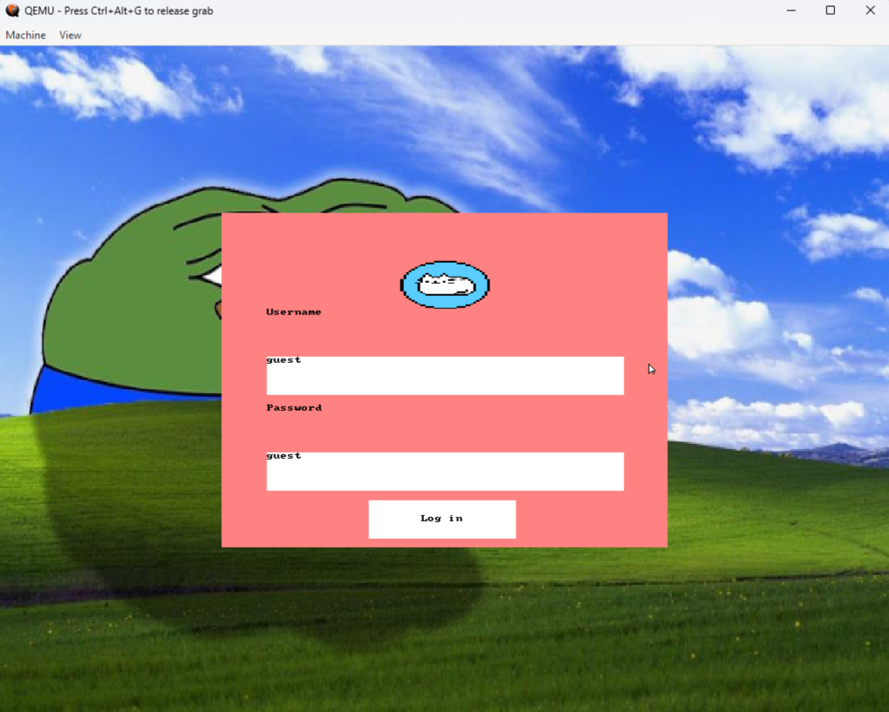
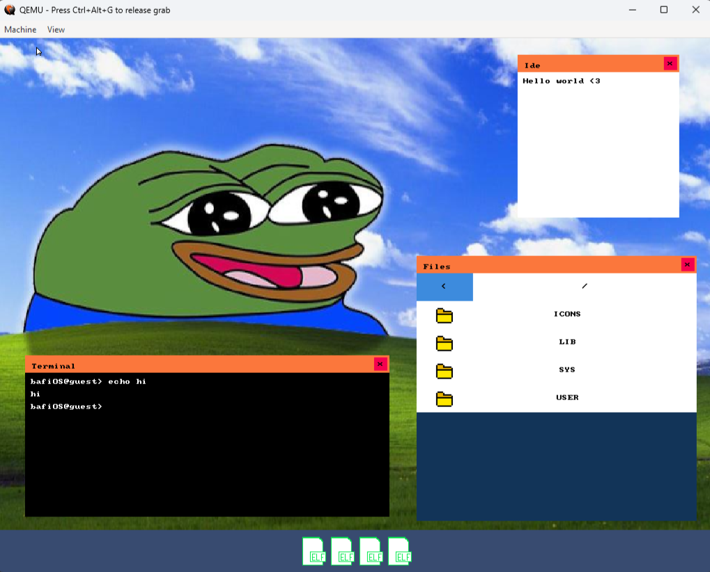

# BafiOS 🦀⚙️

A baremetal x86_32 operating system crafted from scratch in Rust.





## What is it?

This project delivers a complete OS environment (bootloader + kernel + userspace) built using only Rust and minimal assembly.

## Current Features

- ✅ **Boot Process**: Custom 3-staged bootloader
- ✅ **Graphics**: VBE mode with 24/32-bit color support
- ✅ **Storage**: disk access (ATA PIO + DMA)
- ✅ **Multitasking**: Pre-emptive scheduling on single core
- ✅ **Input**: PS/2 mouse and keyboard support
- ✅ **Files**: Working Fat16 filesystem implementation
- ✅ **Security**: User space separation with syscalls
- ✅ **Interface**: Custom GUI library
- ✅ **Network**: Basic connectivity via RTL8139 driver
- ✅ **Programs**: Dynamic ELF binary loader

Work in progress:
- ❗TTF font support
- ❗Kui rewrite + basic 3D handling
- ❗window manager rewrite

## Coming Soon

- 🚧 **Memory**: Paging
- 🚧 **Terminal**: More commands 
- 🚧 **Libraries**: Shared library support
- 🚧 **Compatibility**: Basic libc implementation
- 🚧 **Internet**: Improved TCP protocol stack
- 🚧 **File system**: custom FS
- 🚧 **Architecture**: Extended 64-bit support

## Build & Run

```bash
# Download the .zip, extract it and run:
make all

# You can also run it in a Docker container
```

## Login Credentials

When booting BafiOS, use the following credentials to access the system:
- **Username:** guest
- **Password:** guest
